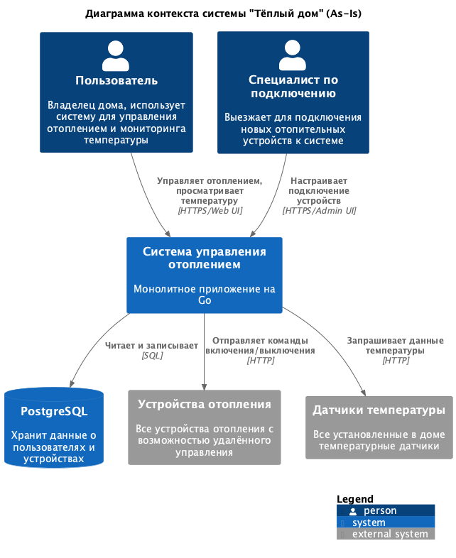
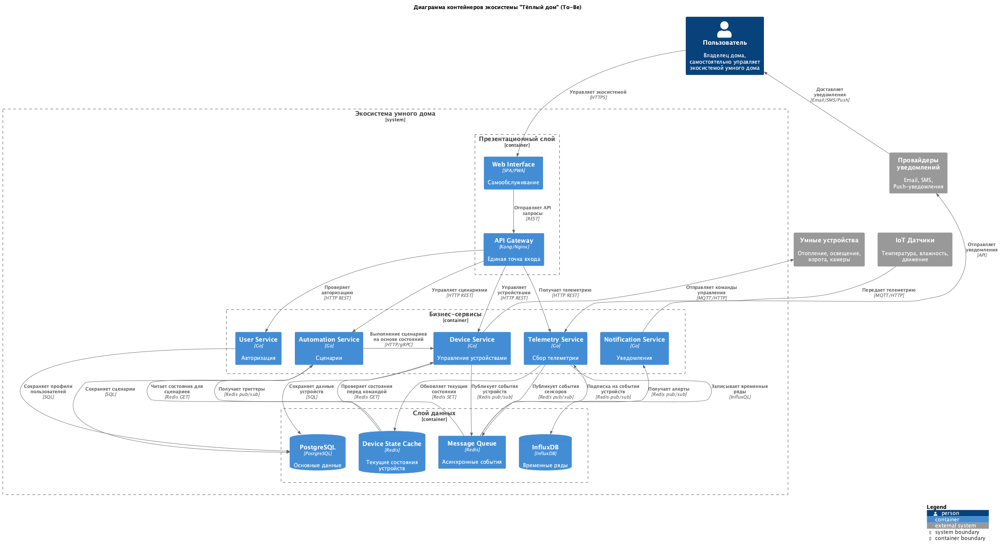
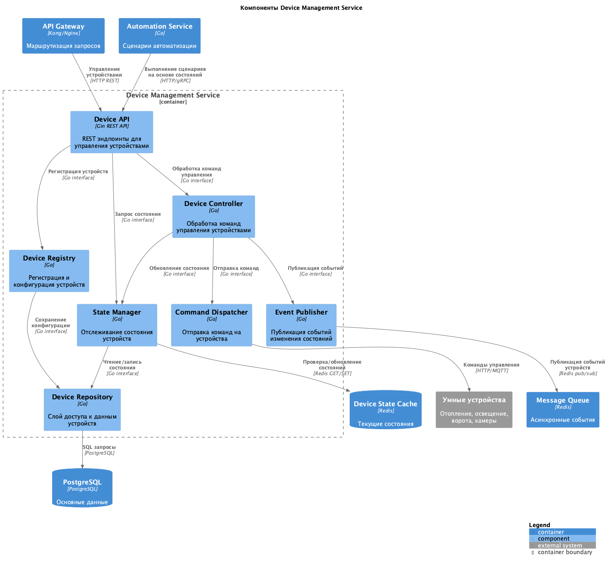
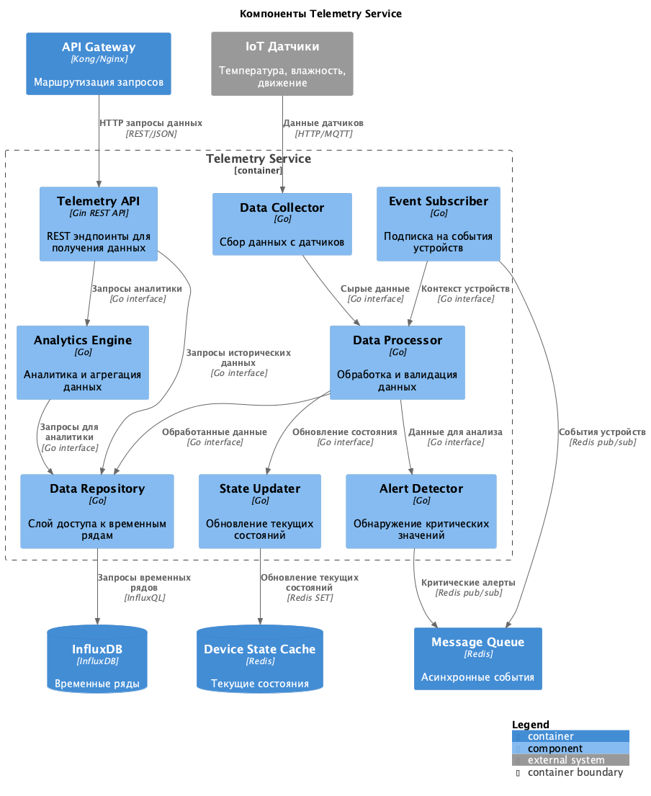
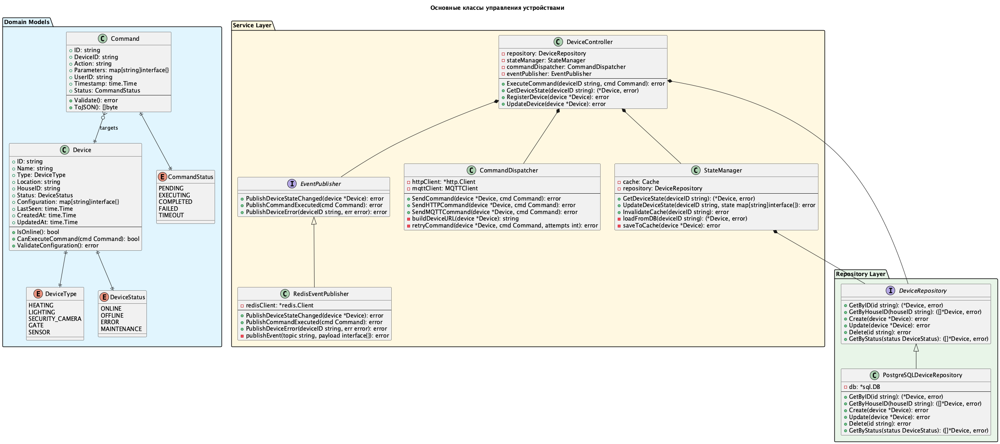
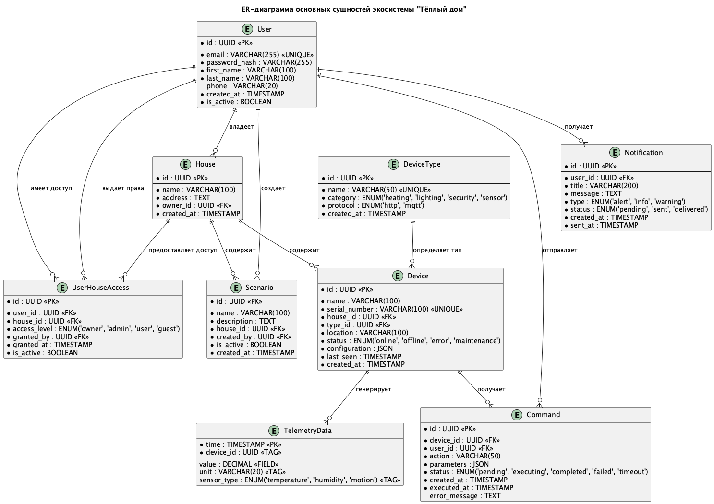

# Project_template

Это шаблон для решения проектной работы. Структура этого файла повторяет структуру заданий. Заполняйте его по мере работы над решением.

# Задание 1. Анализ и планирование

<aside>

Чтобы составить документ с описанием текущей архитектуры приложения, можно часть информации взять из описания компании и условия задания. Это нормально.

</aside

### 1. Описание функциональности монолитного приложения

**Управление отоплением:**

- Пользователи могут удалённо включать/выключать отопление в своих домах через веб-интерфейс
- Система отправляет команды управления на отопительные модули по HTTP протоколу
- Поддерживается синхронное взаимодействие: запрос от пользователя → сервер → устройство отопления
- Каждое подключение системы отопления требует выезда специалиста для настройки
- Пользователь не может самостоятельно подключить новые отопительные устройства

**Мониторинг температуры:**

- Пользователи могут просматривать текущую температуру в своих домах через веб-интерфейс
- Система получает данные о температуре с датчиков по HTTP запросам (pull-модель)
- Данные температуры запрашиваются синхронно от сервера к датчику при необходимости
- Нет возможности получения исторических данных или трендов температуры
- Отсутствует автоматическое уведомление о критических изменениях температуры

### 2. Анализ архитектуры монолитного приложения

_Перечислите здесь основные особенности текущего приложения: какой язык программирования используется, какая база данных, как организовано взаимодействие между компонентами и так далее._

**Технологический стек:**

- **Язык программирования:** Go
- **Веб-фреймворк:** Gin
- **База данных:** PostgreSQL
- **Контейнеризация:** Docker и Docker Compose

**Архитектурные характеристики:**

- **Тип архитектуры:** Монолитная - все компоненты системы (веб-API, бизнес-логика, работа с данными) находятся в рамках одного приложения
- **Модель взаимодействия:** Синхронная - все запросы обрабатываются последовательно, ожидание ответа от внешних систем блокирует выполнение
- **Протокол связи с устройствами:** HTTP (REST API)
- **Модель получения данных:** Pull - сервер активно запрашивает данные у датчиков при необходимости

**Организация компонентов:**

- **Обработка HTTP-запросов:** Gin handlers для REST API эндпоинтов
- **Бизнес-логика:** Services слой для работы с внешними системами (Temperature Service)
- **Модели данных:** Models пакет с определениями структур данных (Sensor)
- **Работа с БД:** Database слой с методами CRUD операций
- **Развертывание:** Single binary deployment, требует остановки всего приложения для обновления

**Ограничения текущей архитектуры:**

- **Масштабируемость:** Ограничена, так как монолит сложно масштабировать по частям
- **Отказоустойчивость:** Отказ любого компонента приводит к недоступности всей системы
- **Технологическая гибкость:** Привязка ко всему стеку технологий при любых изменениях

### 3. Определение доменов и границы контекстов

_Опишите здесь домены, которые вы выделили._

На основе анализа функциональности и бизнес-требований выделены следующие домены:

**1. Домен "Управление устройствами" (Device Management)**

- **Границы контекста:** Управление жизненным циклом устройств умного дома
- **Ответственность:**
  - Регистрация и удаление устройств (самостоятельное подключение пользователями)
  - Конфигурация всех типов устройств (отопление, освещение, ворота, камеры)
  - Отправка команд управления через стандартные протоколы (MQTT, HTTP)
  - Мониторинг состояния и статуса устройств
  - **Кэширование текущих состояний устройств** для быстрого доступа
- **Сущности:** Device, DeviceType, DeviceStatus, Command, DeviceState
- **Микросервис:** Device Management Service

**2. Домен "Пользователи и дома" (User & Home Management)**

- **Границы контекста:** Управление пользователями и их домами
- **Ответственность:**
  - Аутентификация и авторизация пользователей (JWT токены)
  - Управление профилями пользователей
  - Связывание пользователей с домами
  - Права доступа к устройствам
  - **SaaS самообслуживание** - пользователи управляют системой самостоятельно
- **Сущности:** User, House, Permission, UserHouseRelation, JWTToken
- **Микросервис:** User Service

**3. Домен "Телеметрия и мониторинг" (Telemetry & Monitoring)**

- **Границы контекста:** Сбор, хранение и анализ данных с устройств
- **Ответственность:**
  - Получение данных телеметрии с датчиков (температура, влажность, движение)
  - **Публикация событий сенсоров** в очередь для триггеров автоматизации
  - Хранение исторических данных в InfluxDB
  - **Обновление текущих состояний устройств** в Device State Cache
  - Аналитика и отчетность
  - **Удаленное наблюдение за домом**
  - Алертинг при критических значениях
- **Сущности:** TelemetryData, Sensor, Measurement, Alert, DeviceStateSnapshot
- **Микросервис:** Telemetry Service

**4. Домен "Автоматизация и сценарии" (Automation & Scenarios)**

- **Границы контекста:** Программируемые сценарии работы устройств
- **Ответственность:**
  - **Редактор условий и действий** (визуальный конфигуратор)
  - **Планировщик** (выполнение по времени и расписанию)
  - **DSL конфигуратор** для создания сложных сценариев
  - **Программирование пользователями сценариев** по своим потребностям
  - **Чтение текущих состояний устройств** для принятия решений
  - Получение событий от датчиков через очередь
  - Интеграция между устройствами различных производителей
  - Обработка правил и условий с учетом контекста
- **Сущности:** Scenario, Rule, Schedule, Trigger, Condition, Action
- **Микросервис:** Automation Service

**5. Домен "Уведомления" (Notifications)**

- **Границы контекста:** Доставка уведомлений пользователям
- **Ответственность:**
  - Push-уведомления, email, SMS
  - Алерты о критических событиях
  - Настройки предпочтений пользователей
  - Получение алертов от системы телеметрии
  - Форматирование сообщений по шаблонам
- **Сущности:** Notification, NotificationChannel, NotificationPreference, AlertTemplate
- **Микросервис:** Notification Service

**6. Домен "Инфраструктура и интеграция" (Infrastructure & Integration)**

- **Границы контекста:** Обеспечение взаимодействия между сервисами и внешними системами
- **Ответственность:**
  - Единая точка входа для всех клиентов (API Gateway)
  - Маршрутизация запросов к микросервисам
  - Rate limiting и аутентификация на уровне API
  - **Асинхронная коммуникация** через Message Queue
  - **Кэширование состояний устройств** для быстрого доступа
  - Event-driven архитектура
- **Сущности:** APIRoute, MessageEvent, CacheEntry, RateLimitRule
- **Инфраструктурные компоненты:** API Gateway, Message Queue (Redis), Device State Cache (Redis)

### **4. Проблемы монолитного решения**

**Проблемы масштабируемости:**

- Невозможность независимого масштабирования отдельных компонентов (например, только телеметрии при росте количества датчиков)
- Увеличение нагрузки на одну базу данных при росте числа пользователей и устройств
- Ограничения по производительности из-за синхронной обработки запросов

**Проблемы развертывания и обслуживания:**

- Необходимость остановки всего приложения для обновления любого компонента
- Риск "упада" всей системы при ошибке в любом модуле
- Сложность отката изменений - только откат всего приложения целиком

**Проблемы разработки:**

- Все команды разработчиков работают с одной кодовой базой, что создает конфликты
- Сложность внедрения новых технологий - требуется изменение всего стека
- Увеличение времени сборки и тестирования с ростом функциональности

**Бизнес-ограничения:**

- Невозможность быстрого добавления новых типов устройств без изменения ядра системы
- Сложность интеграции с устройствами партнеров из-за жесткой архитектуры
- Ограничения по SaaS-модели - сложно предоставлять разные уровни сервиса

**Операционные проблемы:**

- Отсутствие гибкости в выборе технологий для разных задач (например, для обработки телеметрии могли бы использовать time-series БД)
- Сложность мониторинга и диагностики проблем в разных частях системы
- Невозможность изолированного тестирования отдельных функций

### 5. Визуализация контекста системы — диаграмма С4

_Добавьте сюда диаграмму контекста в модели C4._

Диаграмма контекста текущей системы (As-Is) показывает взаимодействие пользователей с монолитным приложением и внешними устройствами:

[Диаграмма контекста As-Is](schemas/c4_context_as_is.puml)


**Описание взаимодействий:**

**Пользователи системы:**

- **Пользователь** - владелец дома, который управляет отоплением и просматривает температуру через веб-интерфейс
- **Специалист по подключению** - технический персонал, который выезжает для подключения новых устройств

**Основная система:**

- **Система управления отоплением** - монолитное приложение на Go, которое обрабатывает все запросы по управлению отоплением и мониторингу температуры

**Хранилище данных:**

- **PostgreSQL** - база данных для хранения информации о пользователях, устройствах и настройках системы

**Внешние системы:**

- **Устройства отопления** - все подключенные отопительные системы с возможностью удаленного управления по HTTP
- **Датчики температуры** - все установленные температурные датчики, предоставляющие данные по HTTP запросам

**Модель взаимодействия:**

- Все взаимодействие происходит через центральную систему управления отоплением
- Система хранит данные о пользователях и устройствах в PostgreSQL
- Используется pull-модель для получения данных с датчиков по HTTP
- Команды управления отправляются на устройства отопления по HTTP
- Отсутствует возможность самостоятельного подключения устройств пользователями

# Задание 2. Проектирование микросервисной архитектуры

На основе выделенных доменов и бизнес-целей компании спроектированы следующие микросервисы:

## Архитектура микросервисов To-Be

### Основные микросервисы:

**1. User Service (Сервис пользователей)**

- Управление аутентификацией и авторизацией
- Профили пользователей и управление домами
- JWT токены, права доступа

**2. Device Management Service (Сервис управления устройствами)**

- **Регистрация и валидация новых устройств** (проверка совместимости, протоколов)
- Конфигурация всех типов устройств (отопление, освещение, ворота, камеры)
- **Самостоятельное подключение устройств пользователями**
- Отправка команд управления устройствами
- Мониторинг состояния и статуса устройств
- **Поддержка стандартных протоколов** (MQTT, HTTP)

**3. Telemetry Service (Сервис телеметрии)**

- Сбор данных с датчиков (температура, влажность, движение)
- **Публикация событий сенсоров** в очередь для триггеров автоматизации
- Хранение исторических данных в InfluxDB
- Аналитика и отчеты
- **Удаленное наблюдение за домом**

**4. Automation Service (Сервис автоматизации)**

- **Редактор условий и действий** (визуальный конфигуратор)
- **Планировщик** (выполнение по времени и расписанию)
- **DSL конфигуратор** для создания сложных сценариев
- **Программирование пользователями сценариев по своим потребностям**
- Получение событий от датчиков через очередь
- Интеграция между устройствами различных производителей

**5. Notification Service (Сервис уведомлений)**

- Push-уведомления, email, SMS
- Алерты о критических событиях
- Настройки предпочтений пользователей

### Инфраструктурные сервисы:

**6. API Gateway**

- Единая точка входа для клиентов
- Маршрутизация запросов к микросервисам
- Rate limiting, аутентификация

**7. Message Queue (Redis)**

- Асинхронная коммуникация между сервисами
- Event-driven архитектура
- Обработка событий от устройств

### Диаграмма контейнеров:

[Диаграмма контейнеров To-Be](schemas/c4_containers_to_be.puml)


### Взаимодействия между микросервисами:

- Микросервисы взаимодействуют через API Gateway, который обеспечивает единую точку входа
- Асинхронная коммуникация между сервисами осуществляется через Message Queue (Redis)
- **Automation Service** отправляет команды на **Device Service** для выполнения сценариев автоматизации
- **Device Service** отправляет команды управления на внешние устройства по протоколам MQTT/HTTP
- **Telemetry Service** получает данные с датчиков и публикует события в очередь
- **Telemetry Service** также подписывается на события устройств из очереди для контекстуализации данных
- **Automation Service** подписывается на события телеметрии и выполняет сценарии автоматизации
- **Notification Service** получает алерты и отправляет уведомления пользователям

### Взаимодействия с базами данных:

- **User Service, Device Service, Automation Service и Notification Service** используют **PostgreSQL** для хранения основных данных
- **Telemetry Service** использует **InfluxDB** для эффективного хранения временных рядов данных
- **Redis** выполняет две функции:
  - **Message Queue** для асинхронных событий между микросервисами
  - **Device State Cache** для хранения текущих состояний всех устройств

### Поток обработки данных от датчика до действия:

1. **IoT Датчики** → **Telemetry Service** (передача телеметрии по MQTT/HTTP)
2. **Telemetry Service** → **Device State Cache** (обновление текущих состояний устройств)
3. **Telemetry Service** → **Message Queue** (публикация событий сенсоров)
4. **Message Queue** → **Automation Service** (получение триггеров для сценариев)
5. **Automation Service** ← **Device State Cache** (чтение текущих состояний для принятия решений)
6. **Automation Service** → **Device Service** (выполнение команд на основе состояний)
7. **Device Service** ← **Device State Cache** (проверка состояний перед отправкой команд)
8. **Device Service** → **Умные устройства** (отправка команд управления)
9. **Alert Detector** → **Message Queue** → **Notification Service** (критические алерты)

### Кэширование состояний устройств:

- **Telemetry Service** записывает в **Device State Cache** последние показания всех датчиков и устройств
- **Automation Service** читает состояния для принятия решений (например, "выключить свет, только если он включен")
- **Device Management Service** проверяет текущие состояния перед отправкой команд для оптимизации

**Диаграмма компонентов (Components)**

Детализируем внутреннюю структуру ключевых микросервисов:

### Device Management Service Components

[Компоненты Device Management Service](schemas/c4_components_device_service.puml)


### Telemetry Service Components

[Компоненты Telemetry Service](schemas/c4_components_telemetry_service.puml)


**Диаграмма кода (Code)**

Детализируем критичные части системы на уровне кода:

### Device Management Core Classes

[Основные классы управления устройствами](schemas/c4_code_device_classes.puml)


# Задание 3. Разработка ER-диаграммы

На основе анализа предметной области и спроектированных микросервисов определены основные сущности системы и их взаимосвязи.

## Основные сущности системы

### Ключевые сущности (представлены на ER-диаграмме):

**1. User (Пользователь)**

- `id` — уникальный идентификатор пользователя
- `email` — электронная почта (уникальная)
- `password_hash` — хэш пароля
- `first_name`, `last_name` — имя и фамилия
- `phone` — номер телефона
- `is_active` — активность аккаунта

**2. House (Дом)**

- `id` — уникальный идентификатор дома
- `name` — название дома
- `address` — адрес
- `owner_id` — владелец дома (FK к User)

**3. DeviceType (Тип устройства)**

- `id` — уникальный идентификатор типа
- `name` — название типа устройства
- `category` — категория (heating, lighting, security, sensor)
- `protocol` — протокол связи (http, mqtt)

**4. Device (Устройство)**

- `id` — уникальный идентификатор устройства
- `name` — название устройства
- `serial_number` — серийный номер
- `house_id` — дом, к которому принадлежит (FK к House)
- `type_id` — тип устройства (FK к DeviceType)
- `location` — расположение в доме
- `status` — текущее состояние (online, offline, error, maintenance)
- `configuration` — JSON конфигурация

**5. Command (Команда)**

- `id` — уникальный идентификатор команды
- `device_id` — целевое устройство (FK к Device)
- `user_id` — пользователь, отправивший команду (FK к User)
- `action` — действие для выполнения
- `parameters` — JSON параметры команды
- `status` — статус выполнения (pending, executing, completed, failed, timeout)

**6. TelemetryData (Телеметрия)**

- `time` — временная метка (первичный ключ для time-series)
- `device_id` — устройство-источник данных (TAG)
- `value` — значение измерения (FIELD)
- `unit` — единица измерения (TAG)
- `sensor_type` — тип датчика (temperature, humidity, motion) (TAG)

**7. Scenario (Сценарий)**

- `id` — уникальный идентификатор сценария
- `name` — название сценария
- `description` — описание
- `house_id` — дом, к которому относится (FK к House)
- `created_by` — создатель сценария (FK к User)
- `is_active` — активность сценария

**8. UserHouseAccess (Права доступа к дому)**

- `id` — уникальный идентификатор записи доступа
- `user_id` — пользователь (FK к User)
- `house_id` — дом (FK к House)
- `access_level` — уровень доступа (owner, admin, user, guest)
- `granted_by` — кто предоставил доступ (FK к User)
- `granted_at` — время предоставления доступа
- `is_active` — активность доступа

**9. Notification (Уведомление)**

- `id` — уникальный идентификатор уведомления
- `user_id` — получатель (FK к User)
- `title` — заголовок уведомления
- `message` — текст сообщения
- `type` — тип уведомления (alert, info, warning)
- `status` — статус доставки (pending, sent, delivered)

### Дополнительные сущности (не показаны на диаграмме для упрощения):

**User Service:**

(все основные сущности показаны на диаграмме)

**Device Management Service:**

- DeviceConfiguration — детальные параметры конфигурации устройств

**Automation Service:**

- Rule — правила выполнения сценариев
- Trigger — триггеры событий
- Action — действия сценариев
- Schedule — расписания выполнения

**Notification Service:**

- NotificationChannel — каналы доставки (email, SMS, push)
- NotificationTemplate — шаблоны сообщений
- NotificationPreference — настройки пользователей

**Telemetry Service:**

- Sensor — характеристики датчиков
- Alert — алерты о критических событиях

## ER-диаграмма

[ER-диаграмма экосистемы](schemas/er_diagram.puml)


## Основные связи между сущностями

### 1. Пользователь — Дом (один-ко-многим / многие-ко-многим)

**Владение (один-ко-многим):**

- Один пользователь может владеть несколькими домами
- Каждый дом принадлежит одному владельцу

**Доступ (многие-ко-многим через UserHouseAccess):**

- Один пользователь может иметь доступ к нескольким домам
- Один дом может предоставлять доступ нескольким пользователям

### 2. Дом — Устройство (один-ко-многим)

- Один дом может содержать множество устройств
- Каждое устройство принадлежит только одному дому

### 3. Тип устройства — Устройство (один-ко-многим)

- Один тип устройства может иметь множество экземпляров
- Каждое устройство имеет один определенный тип

### 4. Пользователь — Команда (один-ко-многим)

- Один пользователь может отправлять множество команд
- Каждая команда отправляется одним пользователем

### 5. Устройство — Команда (один-ко-многим)

- Одно устройство может получать множество команд
- Каждая команда направлена на одно устройство

### 6. Устройство — Телеметрия (один-ко-многим)

- Одно устройство может генерировать множество записей телеметрии
- Каждая запись телеметрии принадлежит одному устройству

### 7. Дом — Сценарий (один-ко-многим)

- Один дом может содержать множество сценариев автоматизации
- Каждый сценарий относится к одному дому

### 8. Пользователь — Сценарий (один-ко-многим)

- Один пользователь может создавать множество сценариев
- Каждый сценарий создается одним пользователем

### 9. Пользователь — Уведомление (один-ко-многим)

- Один пользователь может получать множество уведомлений
- Каждое уведомление адресовано одному пользователю

## Принципы проектирования

- **Простота:** Диаграмма содержит только ключевые сущности для понимания основной структуры
- **SaaS паттерны:** UserHouseAccess реализует многоуровневый доступ, типичный для SaaS решений
- **Микросервисность:** Сущности логически группируются по доменам/сервисам
- **Гибкость:** JSON поля для конфигураций, ENUM для статусов
- **Производительность:** UUID ключи, time-series структура для телеметрии

# Задание 4. Создание и документирование API

### 1. Типы API и архитектурные решения

В экосистеме "Тёплый дом" используется **гибридный подход** с комбинацией синхронного и асинхронного взаимодействия:

**REST API (синхронное взаимодействие):**

- **User Service** - аутентификация, управление профилями, права доступа
- **Device Management Service** - регистрация устройств, отправка команд, получение состояний
- **API Gateway** - единая точка входа, маршрутизация

**AsyncAPI (асинхронное взаимодействие):**

- **Telemetry Service** - публикация событий телеметрии в Message Queue
- **Automation Service** - подписка на события, выполнение сценариев
- **Notification Service** - отправка уведомлений

**Обоснование выбора:**

- **REST API** выбран для операций, требующих немедленного ответа (команды устройствам, аутентификация)
- **AsyncAPI** используется для событийно-ориентированной архитектуры (телеметрия, автоматизация, уведомления)
- Такой подход обеспечивает масштабируемость и отказоустойчивость системы

### 2. Документация API

#### REST API спецификации (OpenAPI 3.0):

- **[Device Management Service API](schemas/device-management-api.yaml)** - включает эндпоинты для управления устройствами: регистрация, получение статуса, отправка команд
- **[User Service API](schemas/user-service-api.yaml)** - предоставляет API для аутентификации пользователей, управления профилями и домами с многоуровневым доступом

#### Асинхронные API (AsyncAPI 2.6):

- **[Telemetry Events API](schemas/telemetry-events-asyncapi.yaml)** - описывает структуру телеметрических событий (измерения температуры, команды устройств), которые публикуются в очередь Redis

# Задание 5. Работа с docker и docker-compose

Перейдите в apps.

Там находится приложение-монолит для работы с датчиками температуры. В README.md описано как запустить решение.

Вам нужно:

1. сделать простое приложение temperature-api на любом удобном для вас языке программирования, которое при запросе /temperature?location= будет отдавать рандомное значение температуры.

Locations - название комнаты, sensorId - идентификатор названия комнаты

```
	// If no location is provided, use a default based on sensor ID
	if location == "" {
		switch sensorID {
		case "1":
			location = "Living Room"
		case "2":
			location = "Bedroom"
		case "3":
			location = "Kitchen"
		default:
			location = "Unknown"
		}
	}

	// If no sensor ID is provided, generate one based on location
	if sensorID == "" {
		switch location {
		case "Living Room":
			sensorID = "1"
		case "Bedroom":
			sensorID = "2"
		case "Kitchen":
			sensorID = "3"
		default:
			sensorID = "0"
		}
	}
```

2. Приложение следует упаковать в Docker и добавить в docker-compose. Порт по умолчанию должен быть 8081

3) Кроме того для smart_home приложения требуется база данных - добавьте в docker-compose файл настройки для запуска postgres с указанием скрипта инициализации ./smart_home/init.sql

Для проверки можно использовать Postman коллекцию smarthome-api.postman_collection.json и вызвать:

- Create Sensor
- Get All Sensors

Должно при каждом вызове отображаться разное значение температуры

Ревьюер будет проверять точно так же.

---

Пятое задание — дополнительное. Его можно сделать по желанию. Чтобы ревьюер быстрее проверил ваше решение, укажите, сделали вы это задание или нет. Для этого оставьте нужный эмодзи около заголовка задания:
